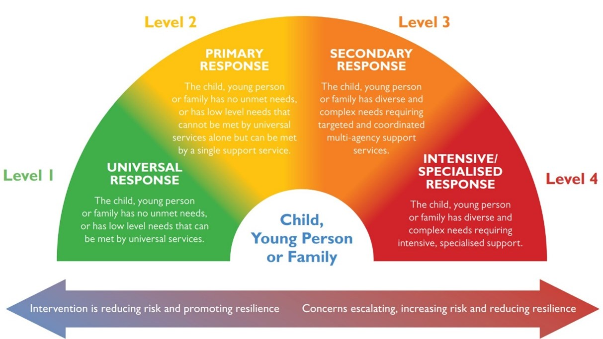
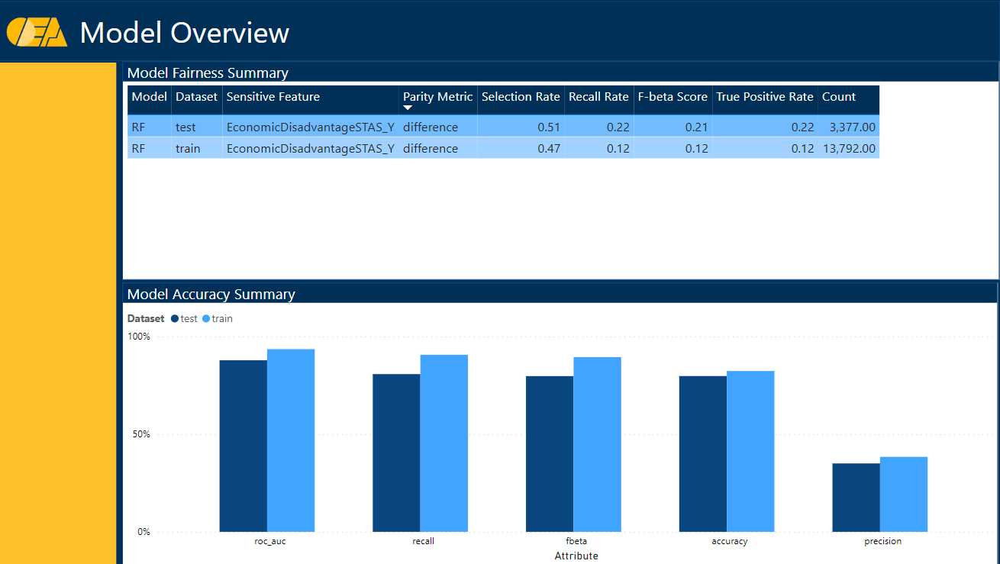
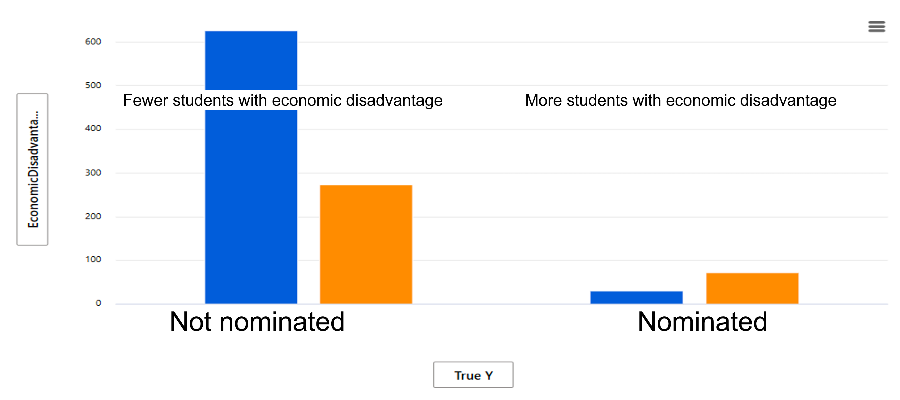
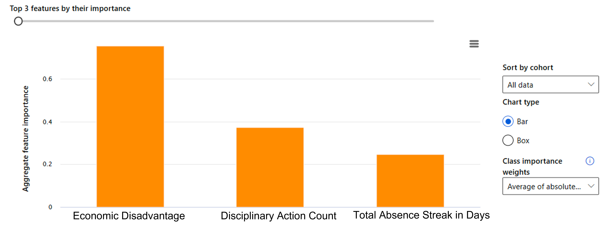
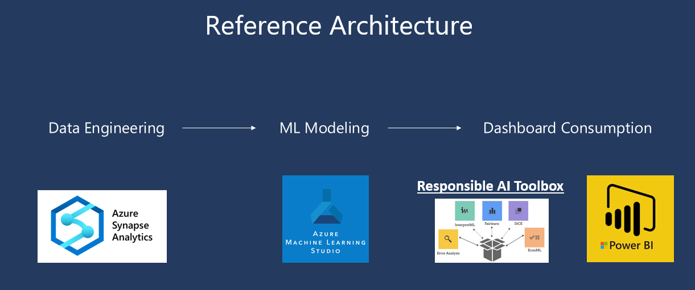

**Some or all of the functionality of this package is available as part of a preview release. The content and the functionality are subject to change.**

# Predicting Student Well-Being Package

## Project overview

The OEA Predicting Student Well-Being Package provides a set of assets which support an education system in developing their own predictive model to address students' need for well-being support. There are two main components of this package:
1.	<ins>Guidance and documentation:</ins> The [OEA Predicting Student Well-being Package - Use Case Documentation](docs/Predicting%20Student%20Well-Being%20OEA%20Use%20Case%20Documentation.pdf) provides guidance on the end-to-end process of developing a predictive model of student well-being use case project, including how to engage stakeholders in the project, prior research on the use case problem domain and theory, how to map data sources to the theory of the problem, and how to implement Microsoft’s Principles of Responsible Data and AI in the process of predictive modelling. <em> It is highly recommended for any education organization that considers using this OEA package to review the Use Case documentation and to revise it for specific data and decisions of your education system's context. </em>
2.	<ins>Technical assets</ins>: Various assets are freely available in this package to help accelerate implementation of a system to nominate student for well-being assessments and support. Assets include descriptions of data sources, a Synapse pipeline for data processing, notebooks for ML model building and [Responsible AI dashboards](https://responsibleaitoolbox.ai/) on AzureML, and sample PowerBI dashboards. See descriptions of technical assets below.

<ins>Important Note</ins>: It is strongly recommended for education systems or institutions that plan to use this package to establish a process for obtaining student, family, guardian, teacher, faculty, and staff **consent for using student data**. This consent should be part of the system or institution’s **broader data governance policy** that clearly specifies who can have access to what data, under what conditions, for what purposes, and for what length of time.

This OEA Package was developed through a partnership between Microsoft Education and the [Department of Education in Tasmania, Australia](https://www.education.tas.gov.au/).

### Video overview 

## Problem statement

Most students in education systems worldwide require some level of personalised care and support, yet the process of identifying type and level of support needed for each individual tends to be subjective and the process can vary considerably by school. Often, interventions are put in place after students already urgently need personalised support or are on the verge of dropping out of school. This is particularly concerning during the global pandemic that has added additional challenges for students and schools.

 
*From Tasmania Department of Education [Child & Family Wellbeing Assessment Tool](https://www.strongfamiliessafekids.tas.gov.au/__data/assets/pdf_file/0016/5551/3-Child-and-Family-Wellbeing-Assessment-Tool.pdf)*

[comment]: # (docs/levels_of_need.png)

Machine learning models offer the potential to find patterns across student attendance, class engagement, academic achievement, health, behavior, safety, demographics, and social-emotional measures to identify if a student needs support. Proactive nomination of students for well-being assessments allows for focused resources to assess students needs and targeted, personalized support. It also helps identify the best means to support them, and ultimately increase student well-being.

## Package impact

This package was developed in collaboration with the Department of Education in Tasmania, Australia (see the [Use Case Documentation](https://github.com/microsoft/OEA-Predicting-Student-Wellbeing/blob/main/docs/Predicting%20Student%20Well-Being%20OEA%20Use%20Case%20Documentation.pdf) for details).
In general, this package can be used by system or institutional leaders, school, or department leaders, support staff, and educators to:
-	<em> nominate </em> students for well-being assessments by support staff
-	<em> understand </em> what type of support resources or interventions might be most effective to promote resilience and well-being with individual students
-	<em> help support staff </em> assess the need for well-being nominations by providing a real-time and detailed snapshot of students based on the predictive models’ insights

### PowerBI dashboards
PowerBI Dashboard can be used to surface high-level trends, patterns, and insights of students getting nominated for well-being assessments. See examples of developed PowerBI dashboards below.

#### Trends and patterns of students nominated for well-being assessment

Stakeholder: **Organization leaders**

#### Top drivers for predicted nomination for well-being assessment 

Stakeholder: **Educators and well-being staff**

#### Highlight model fairness and predictive performance

Stakeholder: **Model developers**

### Responsible AI dashboard
For model developers, the responsible AI principles are critical in shaping the system to be transparent, fair, inclusive, robust and reliable. To operationalize this goal, we recommend the full-suite [RAI dashboard](https://responsibleaitoolbox.ai/) on AzureML to continuously evaluate and improve the model.  

**Model overview**

Get an overall sense of the accuracy performance and distribution of the predictions

**Error analysis**

Discover cohorts in your dataset with most errors to help further investigation  

**Data balance analysis**

Identify data balance issues by label or features in this exploration tool  

**Fairness analysis**

Evaluate how fair the current version of your model is across sensitive feature groups, measured by disparity metrics

**Feature importance**

Discover what are the most important features that contribute to the prediction

**What-if analysis**

Create "What-if" scenarios to suggest personalized preventions to discuss with human experts 

**Causal analysis**

Discover aggregate effect of causal features in your dataset to inform policy and decision-making process 

### Executing RAI principles for students' well-being
For more details on how to execute responsible AI principles in action and adopt RAI system design, watch the following demo:

For more resources on what responsible AI dashboards are, visit the official [walkthrough guide](https://techcommunity.microsoft.com/t5/ai-machine-learning-blog/responsible-ai-dashboard-and-scorecard-in-azure-machine-learning/ba-p/3391068) of RAI Toolbox.  

## Reference architecture

The machine learning model learns from student data to nominate students for well-being assessment and support. The modeling process is done in four main steps:

1.	<ins>Data engineering</ins>: select and aggregate data needed to train the model 
2.	<ins>Feature engineering</ins>: use education context to combine and normalise data 
3.	<ins>Model training and prediction</ins>: a set of machine learning models can be used to train on the selected features and predict whether or not a student should be nominated for personalised well-being assessment 
4.	<ins>RAI and PowerBI dashboards</ins>: [RAI Toolbox](https://responsibleaitoolbox.ai/) is used to support model evaluation from responsible AI perspectives. PowerBI dashboard is also used to access high-level insights for relevant audience. 

## Data sources

This package combines multiple data sources which were identified through Tasmania’s Department of Education’s research as associated with student well-being. The Six Domains of Child and Youth Wellbeing identified include:
*	Being loved and safe
*	Being healthy
*	Participating
*	Having material basics
*	Learning
*	Having a positive sense of culture and identity

The predictive modelling identified and mapped data sources for each of these six domains, though some domains had limited data available. Data sources included attendance, assessment, medical conditions, safety, disabilities, demographics, and behavior. For more information on data model, see [data](https://github.com/microsoft/OEA-Predicting-Student-Wellbeing/tree/main/data) folder. Other data such as digital learning activity could also be used for this modeling, though it was not used in the Tasmania predictive model.

### Note: We are currently working on releasing a sample of test data for other tehnical assets to consume.

This package may also use several [OEA Modules](https://github.com/microsoft/OpenEduAnalytics/tree/main/modules) to help ingest data sources that are often part of student-well-being measures (see below for list of relevant OEA modules).  

| OEA Module | Description |
| --- | --- |
| [Ed-Fi Data Standards](https://github.com/microsoft/OpenEduAnalytics/tree/main/modules/module_catalog/Ed-Fi) | For typical Student Information System (SIS) data, including detailed student attendance, demographic, digital activity, and academic data |
| Microsoft Digital Engagement | Such as M365 [Education Insights](https://github.com/microsoft/OpenEduAnalytics/tree/main/modules/module_catalog/Microsoft_Education_Insights), or [Microsoft Graph](https://github.com/microsoft/OpenEduAnalytics/tree/main/modules/module_catalog/Microsoft_Graph) data |
| Other Learning Management Systems and Apps | Canvas for LMS data, [Clever](https://github.com/microsoft/OpenEduAnalytics/tree/main/modules/module_catalog/Clever) for learning app data and [i-Ready](https://github.com/microsoft/OpenEduAnalytics/tree/main/modules/module_catalog/iReady) for language and math assessments and learning activities |

## Package components
Predicting Student Well-being package was developed by Microsoft in partnership with the Department of Education in Tasmania, Australia. The architecture and reference implementation for all modules is built on [Azure Synapse Analytics](https://azure.microsoft.com/en-us/services/synapse-analytics/), with [Azure Data Lake Storage](https://docs.microsoft.com/en-us/azure/storage/blobs/data-lake-storage-introduction) as the storage backbone, and [Azure Active Directory](https://azure.microsoft.com/en-us/services/active-directory/) providing the role-based access control.

Assets in the package include:

1. <strong>[Use Case Documentation](docs/Predicting%20Student%20Well-Being%20OEA%20Use%20Case%20Documentation.pdf)</strong> 
      * Engaging key stakeholders at the beginning of any data-driven project is essential. The use case document should be completed at the beginning of all projects to clearly define the problem, identify and engage key stakeholders, connect data to research, and address any ethical concerns. Further, completing this document helps to carefully define the problem and approach.
2. <strong>[Notebooks](notebooks)</strong> 
      * Package notebooks provide example code for standardizing and processing data to make ready for machine learning, as well as Responbile AI and PowerBI dashboards. Notebooks were developed to perform ML model training and post processing, and serving data to AML for downstream RAI and PowerBI dashboard consumption.
3. <strong>[Pipelines](pipelines)</strong> 
      * Sample Synapse Pipeline for data cleaning for each category of data items used in the Tasmania dataset, joining multiple datasets to a main data table ready for ML modeling. 
4. <strong>[RAI  Dashboard](rai)</strong> 
      * Example RAI dashboards can operationalize responsible AI principles and surface key data science insights to key stakeholders.
4. <strong>[PowerBI Dashboard](powerbi)</strong> 
      * Example PowerBI dashboards are also showcased for the benefits of key stakeholders including the organization leaders, well-being support teams, and model developers. 

# Legal Notices
Microsoft and any contributors grant you a license to the Microsoft documentation and other content in this repository under the [Creative Commons Attribution 4.0 International Public License](https://creativecommons.org/licenses/by/4.0/legalcode), see the [LICENSE](https://github.com/microsoft/OpenEduAnalytics/blob/main/LICENSE) file, and grant you a license to any code in the repository under the [MIT License](https://opensource.org/licenses/MIT), see the [LICENSE-CODE](https://github.com/microsoft/OpenEduAnalytics/blob/main/LICENSE-CODE) file.

Microsoft, Windows, Microsoft Azure and/or other Microsoft products and services referenced in the documentation may be either trademarks or registered trademarks of Microsoft in the United States and/or other countries. The licenses for this project do not grant you rights to use any Microsoft names, logos, or trademarks. 

See [Microsoft trademark and brand guidelines](http://go.microsoft.com/fwlink/?LinkID=254653) and [Privacy policy](https://privacy.microsoft.com/en-us/) for more details.

Microsoft and any contributors reserve all other rights, whether under their respective copyrights, patents, or trademarks, whether by implication, estoppel or otherwise.
