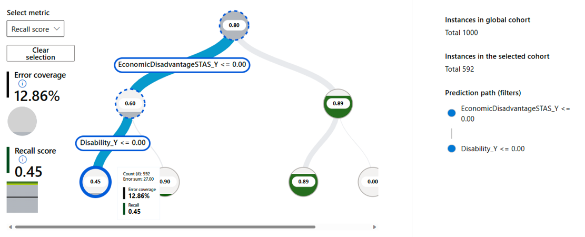
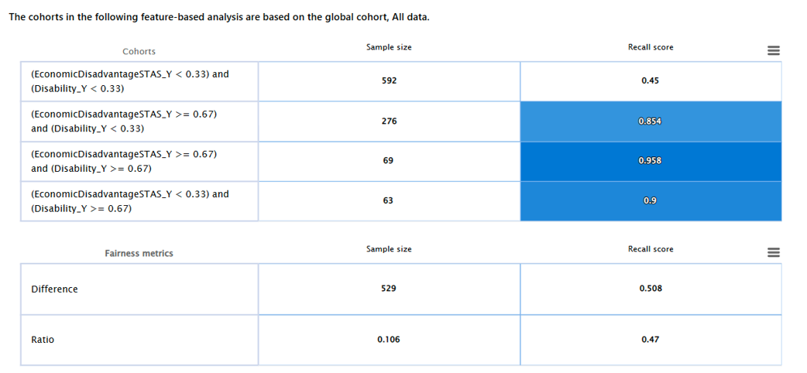
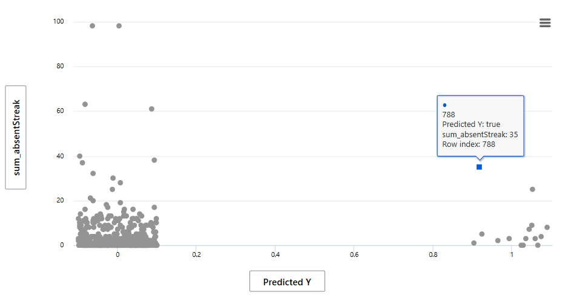
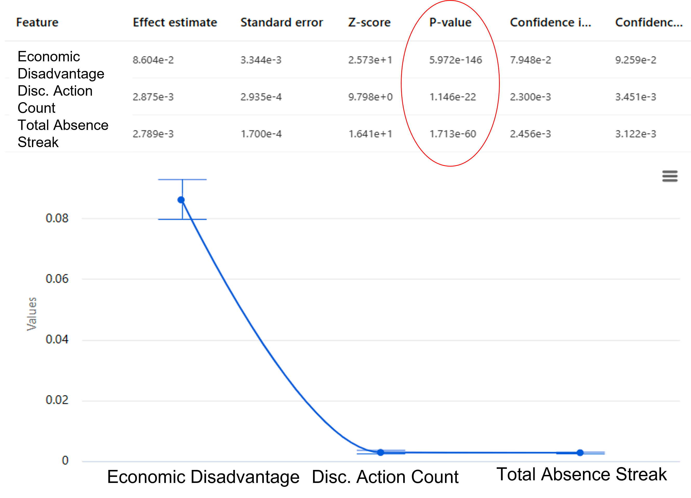

# RAI dashboard

It is highly recommended that users take advantage of the [Responsible AI Dashboard](https://github.com/microsoft/responsible-ai-toolbox) to support best practices from a Responsible AI perspective.

The use of the dashboards facilitate a three-stage human-in-the-loop system design as described in the [Use Case Documentation](docs/Predicting%20Student%20Well-Being%20OEA%20Use%20Case%20Documentation.pdf). 
The three interactive stages include Model Development, Model Consumption, and Model Calibration and Evaluation. They work hand in hand to improve the system in terms of transparency, fairness, robustness and reliability. In general, model developers play a leading role in the Model Development stage.

For model developers, the responsible AI principles are critical in shaping the system to be transparent, fair, inclusive, robust and reliable. To operationalize this goal, [RAI dashboard](https://responsibleaitoolbox.ai/) on AzureML can be used to continuously evaluate and improve the model: 

**Model Overview**

Get an overall sense of the accuracy performance and distribution of the predictions:

**Error Analysis**

Discover cohorts in your dataset with most errors to help further investigation:  

**Data Balance Analysis**

Identify data balance issues by label or features in this exploration tool: 

**Fairness Analysis**

Evaluate how fair the current version of your model is across sensitive feature groups, measured by disparity metrics:

**Feature Importance**

Discover what are the most important features that contribute to the prediction:

**What-if Analysis**

Create "What-if" scenarios to suggest personalized preventions to discuss with human experts: 

For example, this student's well-being may benefit from lowering absence streak from 35 days to 22 days:

**Causal Analysis**

Discover aggregate effect of causal features in your dataset to inform policy and decision-making process: 

For more details on how to use these dashboards, visit the step-by-step [walkthrough guide](https://techcommunity.microsoft.com/t5/ai-machine-learning-blog/responsible-ai-dashboard-and-scorecard-in-azure-machine-learning/ba-p/3391068). The guide walks you through how to evaluate models using:
- the [RAI UI on AzureML studio](https://github.com/microsoft/OpenEduAnalytics/tree/main/packages/package_catalog/Predicting_Student_Well_Being/images/) 
- SDK as demonstrated in the package notebook [BuildRAIDashboard](https://github.com/microsoft/OpenEduAnalytics/tree/main/packages/package_catalog/Predicting_Student_Well_Being/notebooks/RAIBuildDashboard.ipynb), and
- the RAI scorecard downloadable as a pdf.

